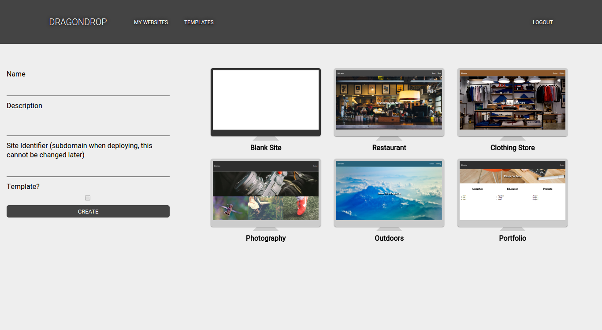
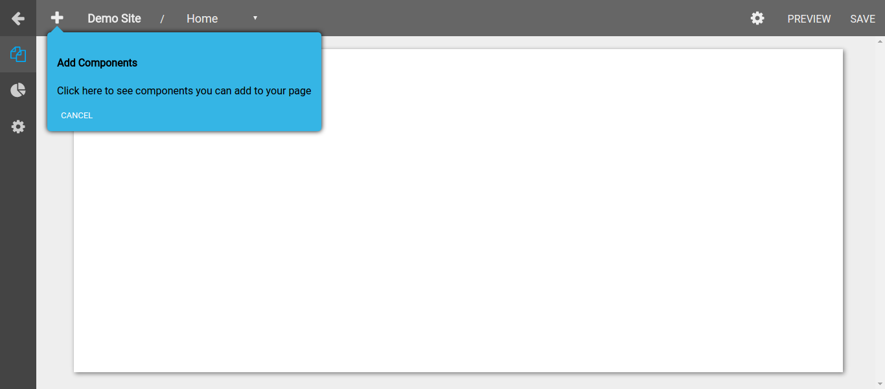
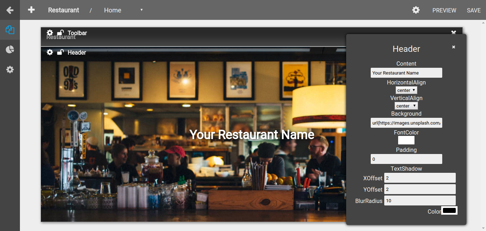
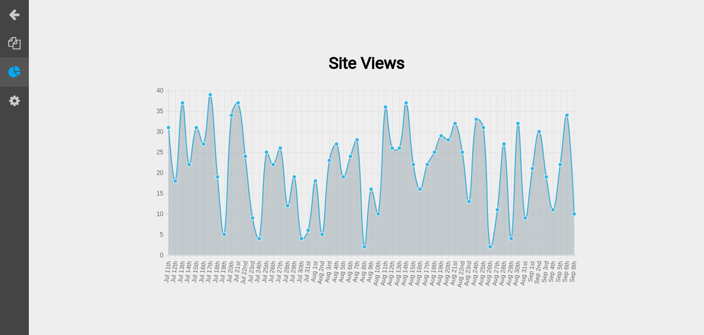

# DRAGONDROP
[DRAGONDROP live](http://www.dragon-drop.com)

DRAGONDROP is a full-stack web application for easy and fast creation of static websites. The backend utilizes Ruby on Rails with PostgreSQL as a database. The frontend is build out with React.js for views and a Redux architecture to hold data.

## Features & Implementation
[Website Creation](website-creation)</br>
[Website Building](website-building)</br>
[Website Deployment](website-deployment)</br>
[Analytics](analytics)
### Single-Page Application
DRAGONDROP is a single-page application. All content is delivered on one static page, which makes requests to the backend to receive the data that it needs.

### Website Creation
DRAGONDROP enables the user to create websites either from scratch or from a pre-made template. Users can also create a template site for other users to create with. When creating a site from a template the frontend makes a request to the backend which finds the template site, makes a deep duplicate of the template (site, pages, components) and sets the owner of the duplicate to the current user. When creating a site from scratch the database creates a new site with a default home page.




### Website Building

Once a user has created their new website they are taken to the site editor. In the editor a `Tour` is provided to walk the user through how the `Site Editor`. Here they have the ability to add new pages, and add components to each page from a provided component catalog. These components can be dragged, dropped, and resized to achieve the users desired layout. Each component has it's own properties that can be modified by the user by clicking its settings button or double clicking on it.



##### Behind The Scenes
###### Components
`Component`s are the models that are used to hold all information about each element on a page. They have information about the React Component they represent, the properties that should be passed to the React Component and the layout properties.

###### React Props
Each React Component in the catalog can specify which props it wants to allow the user to manipulate and what kind of input should be used to represent that prop. This is achieved by adding another property to the component called inputTypes (Very similarly as you would add propTypes or defaultProps to a React Component). This inputTypes property is an object with keys of the prop name to manipulate and a value of an `InputType`.`InputType`s are a group of custom components I wrote to declaratively create inputs based on the structure of the data that is desired. The code for these InputTypes can be found [here](https://github.com/gregchamberlain/react-declarative-forms).

```js
const MyComponent = (props) => (
  ...
)

MyComponent.inputTypes = {
  name: InputTypes.string({label: 'Name'}),
  textAlign: InputTypes.select({label: 'Text Align'})(['left', 'center', 'right']),
  textShadow: InputTypes.object({label: 'Text Shadow'})({
    xOffset: InputTypes.number({label: 'X Offset'}),
    yOffset: InputTypes.number({label: 'Y Offset'}),
    blurRadius: InputTypes.number({label: 'Blur Radius'}),
    color: InputTypes.color({label: 'Shadow Color'}),
  })
}
```

A huge upside of using these InputTypes is that any 3rd party component could be easily added to the catalog with very little modifications. In many cases just adding this InputTypes attribute would be sufficient.

In the `Site Editor` page when a user opens a component's settings a PropsEditor opens. This props editor gets the information about the selected component from the redux store. It uses this data to dynamically generate a form based on the React Components inputTypes, and fills this form with the data from the `Component`s props.



###### Layout
The layout of the `Component`s on each page is handled by the [react-grid-layout](https://github.com/STRML/react-grid-layout) library. Using the onLayoutChange property of this library an action is dispatched to the Redux store. This action is handled by the `ComponentReducer` and sets the layout attribute on each `Component`.

###### Saving
The user has the ability to save each page once they have done some work on it. This save sends a request the the backends `PagesController` with the updated page data, including nested attributes for each component.

### Website Deployment
After the user is satisfied with the state of their newly created website they can choose to deploy their site. Once deployed their website will be hosted at a subdomain (represented by their sites unique identifier) of [dragon-drop.com](www.dragon-drop.com) ie. (my-cool-site.dragon-drop.com). This is achieved by the backend making a request to AWS S3. In this request a bucket is created with the full name of their new url. This bucket is then configured throught the AWS api to be configured as a static website. An `index.html`, `bundle.js`, `styles.css`, and `data.js` are inserted into the bucket. The `bundle.js` is the meat of the website, holding the code to dynamically generate pages depending on the data in `data.js`. The `bundle.js` handles all the routing between pages, rendering page layouts, and passing props into components. It also makes API requests the the backend when a user views the site/page to record analytics data. `data.js` holds all of the information about how the website should be generated. This includes general site information, pages, as well as components belonging to each page.

### Analytics

DRAGONDROP records analytics data about a users deployed website. This records the amount of views a deployed site gets and is available to view by the site owner from the analytics tab site dashboard.




## Future Direction For This Project
0. More diverse and functional React Components for the `Catalog`.
0. Allow 3rd party developers to create and sell React Components in the catalog.
0. Better analytics tracking.
0. Custom Redux architecture on the deployed site to allow creation of plugins that control data on the client site.
